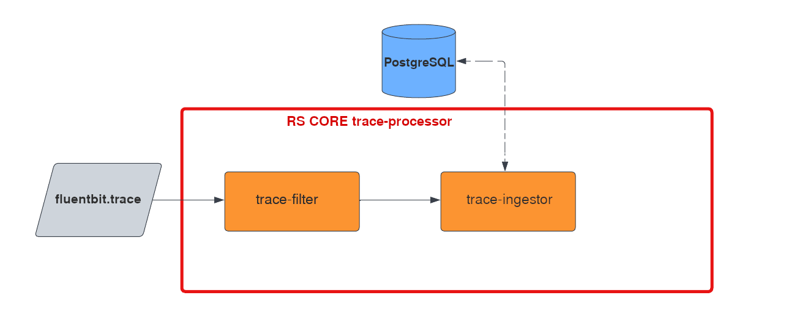

:arrow_heading_up: Go back to the [Reference System Sotfware repository](https://github.com/COPRS/reference-system-software) :arrow_heading_up:

# Monitoring

This repository contains [RS-CORE Monitoring](#rs-core-monitoring) to handle trace to be able to monitor state of product produced by ingestion chain and even all Sentinel processing chain.

The repository also contains two FINOPS components:
- [object-storage-exporter](#object-storage-exporter)
- [resources-exporter](#resources-exporter)

## RS-CORE Monitoring

[](https://github.com/COPRS/monitoring/actions/workflows/docker-ci-traceprocessor.yml)

**RS-CORE Monitoring** process trace by filtering desired one and ingesting them in database.


The description of each component of RS-Core is described [here](./trace-processor/README.md)

### Installation

#### Prerequisites

- Infrastructure : all the required tools (such as Kafka and PostgreSQL) are included in the RS infrastructure installation.  
  See  [Reference System Software Infrastructure](https://github.com/COPRS/infrastructure) for details.
- In PostgreSQL, you have to create an empty database (for example: **monitoring**) with a user (and his password) having read/write access to it. This information will be updated in [RS-CORE configuration files](./rs-cores/MONITORING/Release_Note.md)

#### Build

In order to build the project from source, first clone the GitHub repository :

```shellsession
git clone https://github.com/COPRS/monitoring.git
```

Then build the docker images:

```shellsession
mvn clean deploy -Djib.dest-registry=local/rs-docker/monitoring -Djib.goal=dockerBuild
```

And finally build the zip files:

```shellsession
./rs-cores/build_cores.sh
```

The zip files will be found in the rs-core folder.

#### Using Ansible

Run the `deploy-rs-addon.yaml` playbook with the following variables:

- **stream_name**: name given to the stream in *Spring Cloud Dataflow*
- **rs_addon_location**: direct download url of the zip file or zip location on the bastion

#### Manual Install

Download and extract the zip file for the RS-Core to install.  
If necessary, edit the parameters as required (See [Release Note](./rs-cores/MONITORING/Release_Note.md) for parameters description).

- Create all objects defined by files in _Executables/additional_resources_
- Using the SCDF GUI:
  - Register the applications using the content of the _stream-application-list.properties_ file
  - Create the streams using the content fo the _stream-definition.properties_ file
  - Deploy the stream using the properties defined in the _stream-parameters.properties_ file (removing comments)

### Uninstall

Using the SCDF GUI, undeploy then destroy the stream relative to the RS-Core.

## FINOPS components

[](https://github.com/COPRS/monitoring/actions/workflows/docker-ci-finops.yml)


[](https://github.com/COPRS/monitoring/actions/workflows/helm-finops.yml)

These components provide metrics about Cloud Providers resources.

### Object Storage Exporter

This component provide metrics on real time use of storage (object storage)

#### Installation

##### Prerequisites

- Infrastructure : all the required tools (such as Prometheus) are included in the RS infrastructure installation.  
  See  [Reference System Software Infrastructure](https://github.com/COPRS/infrastructure) for details.

##### Build

In order to build the project from source, first clone the GitHub repository :

```shellsession
git clone https://github.com/COPRS/monitoring.git
```

Then build the docker images:

```shellsession
docker build -t <name_image>:<tag> ./finops/object-storage-exporter
```

##### Installing the Chart

To install the chart with the release name `my-release`:

```shellsession
helm repo add rs-artifactory-monitoring https://artifactory.coprs.esa-copernicus.eu/artifactory/rs-helm
helm install my-release rs-artifactory-monitoring/finops-object-storage-exporter
```

These commands deploy Object Storage Exporter on the Kubernetes cluster in the default configuration. [Parameters](./finops/object-storage-exporter/README.md#parameters-of-the-chart) that can be configured during installation.

> Tip: List all releases using `helm list`

### Uninstalling the Chart

To uninstall/delete the `my-release` resources:

```shellsession
helm delete my-release
```

The command removes all the Kubernetes components associated with the chart and deletes the release. Use the option `--purge` to delete all history too.

### Resources Exporter

This component provide metrics on real time use of resources (machines, managed services)

#### Installation

##### Prerequisites

- Infrastructure : all the required tools (such as Prometheus) are included in the RS infrastructure installation.  
  See  [Reference System Software Infrastructure](https://github.com/COPRS/infrastructure) for details.

##### Build

In order to build the project from source, first clone the GitHub repository :

```shellsession
git clone https://github.com/COPRS/monitoring.git
```

Then build the docker images:

```shellsession
docker build -t <name_image>:<tag> ./finops/resources-exporter
```

##### Installing the Chart

To install the chart with the release name `my-release`:

```shellsession
helm repo add rs-artifactory-monitoring https://artifactory.coprs.esa-copernicus.eu/artifactory/rs-helm
helm install my-release rs-artifactory-monitoring/finops-resources-exporter
```

These commands deploy Resources Exporter on the Kubernetes cluster in the default configuration. [Parameters](./finops/resources-exporter/README.md#parameters-of-the-chart) that can be configured during installation.

> Tip: List all releases using `helm list`

### Uninstalling the Chart

To uninstall/delete the `my-release` resources:

```shellsession
helm delete my-release
```

The command removes all the Kubernetes components associated with the chart and deletes the release. Use the option `--purge` to delete all history too.

## Repository Content

The artifactory repository should contain:

- Docker images for all components : https://artifactory.coprs.esa-copernicus.eu/ui/repos/tree/General/rs-docker/monitoring
- RS-Core Monitoring : https://artifactory.coprs.esa-copernicus.eu/ui/repos/tree/General/rs-zip
- Helm Chart for FINOPS components : https://artifactory.coprs.esa-copernicus.eu/ui/repos/tree/General/rs-helm/monitoring


<br>

---

<br>

# Copyright and license

The Reference System Software as a whole is distributed under the Apache License, version 2.0. A copy of this license is available in the [LICENSE](LICENSE) file. Reference System Software depends on third-party components and code snippets released under their own license (obviously, all compatible with the one of the Reference System Software). These dependencies are listed in the [NOTICE](NOTICE.md) file.
