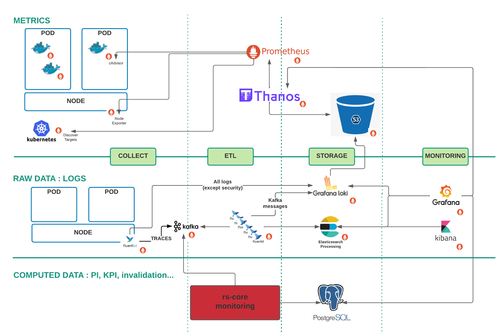

# Architecture Design Document

## Document properties

|    |   |
| -: | - |
|    **Reference** | CSGF-CSC-RS-PRD-ADD-MON |
|        **Issue** | 2 |
|   **Issue date** | 16 Sep 2022 |
|  **Prepared by** | **Cyrille BOUISSON**  *(Architect / Technical Manager)* |
|  **Approved by** | **Jonathan TAGLIONE** (Quality Manager) + **Nicolas Leconte** (Technical Manager) |
|  **Released by** | **Stéphane HURIEZ** (Project Manager) |
|     **Doc type** | SCF |
|       **No WBS** | WP-3000-C |

## Document Summary

This document is the Architecture Document Design for Monitoring of Reference System. This document will be completed all along the software development lifecycle

## Document Change log

| Issue/Revision | Date | Change Requests | Observations |
| :------------: | :--: | --------------- | ------------ |
| 1 | 01 Mar 2022 | | v1.0.0   First issue of document |
| 2 | 16 Sep 2022 | | v1.1.0 |

## Table Of Contents

- [Architecture Design Document](#architecture-design-document)
  - [Document properties](#document-properties)
  - [Document Summary](#document-summary)
  - [Document Change log](#document-change-log)
  - [Table Of Contents](#table-of-contents)
  - [Introduction](#introduction)
    - [Scope](#scope)
    - [Applicable and Reference Documents](#applicable-and-reference-documents)
      - [Applicable documents](#applicable-documents)
      - [Reference documents](#reference-documents)
    - [Glossary](#glossary)
- [Software overview](#software-overview)
    - [Cloud native architecture](#cloud-native-architecture)
    - [Workflows as the core building primitive](#workflows-as-the-core-building-primitive)
    - [Open Source and collaborative mindset](#open-source-and-collaborative-mindset)
    - [High-level of security](#high-level-of-security)
  - [Monitoring services](#monitoring-services)
    - [Data Model](#data-model)
    - [RS-CORE Monitoring](#rs-core-monitoring)
    - [Monitoring HMI](#monitoring-hmi)

## Introduction

The Architecture Design Document (ADD) describes the overall architectural design and the detailed design of each component. Internal interfaces design is also included in this document.

This document is inspired by the ECSS Template of the SDD.

It is completed all along the software development lifecycle.

### Scope

The Architecture Design Document is applicable to the Reference System Project.

### Applicable and Reference Documents

#### Applicable documents

| Reference | Issue no | Title of document |
| --------- | :------: | ----------------- |

#### Reference documents

| Acronym | Reference   | Issue no | Title of document |
| :-----: | :---------: | :------: | ----------------- |
| ADD INF | CSGF-CSC-RS-PRD-ADD-INF | 2 | Architecture Design Document |

### Glossary

| Term | Definition |
| ---- | ---------- |
| ADD | Architecture Design Document |
| ECSS | European Cooperation for Space Standardization |

# Software overview

The Copernicus Reference System Service is the key component of the CSC Ground Segment. It provides an open source and versatile capacity to integrate and validate new Sentinel Data Processors and therefore to improve performances of the system.

Moreover, the service is able to substitute temporarily the nominal Production and Distribution services with a high-demanding level of service.

Finally this service environment brings a new mind-set in the development based on an open source community to reinforce the adoption and attractiveness of Sentinel data.

### Cloud native architecture

The system is based on a full Cloud native system so the solution can meet Copernicus unpredictable user scenarios while optimizing costs. Sentinel-1 PDGS returns of experience is fully integrated in the design of the service.

Furthermore, the Reference System interfaces directly with a cloud orchestrator. Services are launched, duplicated and terminated in synergy with the underlying Cloud infrastructure so the complete system adapts quickly to the current system load or spontaneous failures.

This strategy prevents from procuring a dedicated infrastructure and is in line with the global transformation of IT services relying on the maturity reached by Cloud Service Providers. Public clouds are naturally opened on the Internet and therefore well fitted for services with a public access.

In addition, building a cloud agnostic solution allows to take advantage of the fair competition between Cloud Service Providers and to be freed from the cloud provider’s own priorities and strategies.

### Workflows as the core building primitive

Workflows allow breaking down complex problems into smaller, reusable pieces. With this simple definition, one can argue this technique is already used by the Consortium in previous Copernicus programs, such as Sentinel 1 PDGS: processors do collaborate to produce more and more advanced products as production progresses. Yet, they only exist implicitly in the system as the consequence of the configuration of the communication channels between processors.

In the Reference System requirements, workflows appear as interface elements, which users can browse, instantiate and monitor. The design promotes workflows as a key concept on top of which the rest of the system is built. We integrate Spring Cloud Data Flow, a cloud-native programming and operating model for composable data micro services, to develop our system as a collection of workflows, each orchestrating business specific micro services.

Since this concept is built into the orchestrator, the system exposes excellent progress information and error handling mechanisms out of the box. No need to reconstruct workflow states by correlating monitoring data from individual micro services. The operation, monitoring and maintenance of the system are therefore made easier. Less operators are required and using a parametric cost model allows to offer the right service for the right costs for the benefits of both the users and the Agency.

### Open Source and collaborative mindset

With the Reference System Service, the Agency goes a step further with the set-up of an open-source community for the Reference System software. This software is the exact complement of the Sentinel Data Processors. It provides all the components to integrate the Sentinel Data Processors, which are driven by the Agency, in processing chains and to distribute the output products. Having an open source software opened to the public allows a better visibility of the Copernicus software and a better chance to meet the scientific and business community expectations.

Moreover, contributors are actively improving the quality of the software by reporting anomalies and in some cases proposing correction and/or evolution for the benefits of all users.

### High-level of security

Building upon the experience of the two last decades, security has become a pillar of ground segments. Airbus gathers a significant experience in integrated security in the different program phases and activities. Airbus organization encourages designer to introduce security at the design stage.

Hence, the security management for the Reference System Service is based on a strategy of response to the major security risks, by integrating defence and preventive mechanism during the design phase (DevSecOps).

The same approach has been adopted with success on the Sentinel-1 Cloud PDGS program, and on other Airbus Ground Segments.

## Monitoring services

It's based on the Monitoring Chain that is decribed in [ ADD INF ]

The computed data are PI/KPI data. These data are determined through different micro services and stored in a database contained in the PostgresQL instance (cf chapter **Backend services > PostgreSQL** in [ ADD INF ])

### Data Model

It's described [here](../../trace-processor/README.md)

### RS-CORE Monitoring

It's described here :
- [Overview](../../README.md#overview)
- [Micro services](../../trace-processor/README.md)
- [Release Note](../../rs-cores/MONITORING/Release_Note.md)

### Monitoring HMI

It's decribed in chapter **Monitoring services > Monitoring** of [ ADD INF ]
