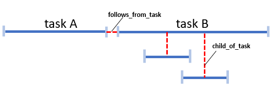

# Interface Control Document

## Document properties

|    |   |
| -: | - |
|    **Reference** | : CSGF-CSC-RS-PRD-ICD-MON |
|        **Issue** | 2 |
|   **Issue date** | 16 Sep 2022 |
|  **Prepared by** | **Cyrille BOUISSON**  *(Architect / Technical Manager)* |
|  **Approved by** | **Jonathan TAGLIONE** (Quality Manager) + **Nicolas Leconte** (Technical Manager) |
|  **Released by** | **Stéphane HURIEZ** (Project Manager) |
|     **Doc type** | SCF |
|       **No WBS** | WP-3000-C |

## Document Summary

This document is the Interface Control Document for Monitoring of Reference System. This document will be completed all along the software development lifecycle.

## Document Change log

| Issue/Revision | Date | Change Requests | Observations |
| :------------: | :--: | --------------- | ------------ |
| 1 | 01 Mar 2022 | | v1.0.0 <br> First issue of document |
| 2 | 16 Sep 2022 | | v1.1.0 |

## Table Of Contents

- [Interface Control Document](#interface-control-document)
  - [Document properties](#document-properties)
  - [Document Summary](#document-summary)
  - [Document Change log](#document-change-log)
  - [Table Of Contents](#table-of-contents)
  - [Introduction](#introduction)
    - [Scope](#scope)
    - [Applicable and Reference Documents](#applicable-and-reference-documents)
      - [Applicable documents](#applicable-documents)
      - [Reference documents](#reference-documents)
    - [Glossary](#glossary)
  - [Software overview](#software-overview)
  - [Requirement and design](#requirement-and-design)
    - [General provisions to the interface requirements](#general-provisions-to-the-interface-requirements)
    - [Interface requirements complementary definition](#interface-requirements-complementary-definition)
    - [Interface design](#interface-design)
      - [LOG interface design](#log-interface-design)
        - [General information](#general-information)
          - [Purpose](#purpose)
          - [General](#general)
        - [Log format](#log-format)
          - [Header](#header)
          - [Message](#message)
          - [Application custom fields](#application-custom-fields)
      - [Trace interface design](#trace-interface-design)
        - [General](#general-1)
          - [Source](#source)
          - [Purpose](#purpose-1)
        - [Format](#format)
          - [Sections](#sections)
          - [Header](#header-1)
          - [Message](#message-1)
          - [Task](#task)
          - [Application custom fields](#application-custom-fields-1)
          - [Custom key/value format](#custom-keyvalue-format)
          - [Full samples](#full-samples)
  - [Validation requirements](#validation-requirements)
  - [Traceability](#traceability)

## Introduction

The Interface Control Document (ICD) describes the interfaces that must be respected by external services that want to integrate an application into the system.

This document is based on the ECSS Template of the ICD.

It is completed all along the software development lifecycle.

### Scope

The Interface Control Document is applicable to the Reference System Project.

### Applicable and Reference Documents

#### Applicable documents

| Reference | Issue no | Title of document |
| --------- | :------: | ----------------- |
| COPRS-ICD-ADST-001048444 | 2.0 | RS Log Interface Control Document |
| COPRS-ICD-ADST-001048446 | 3.0 | Interface Control Document Reference System Trace format |

#### Reference documents

| Acronym | Reference   | Issue no | Title of document |
| :-----: | :---------: | :------: | ----------------- |
| SVVD COPRS | CSGF-CSC-RS-TST-SVVD-INF | 2 | Software Verification and Validation Test Document |

### Glossary

| Term | Definition |
| ---- | ---------- |
| ECSS | European Cooperation for Space Standardization |
| ICD | Interface Control Document |

## Software overview

The Copernicus Reference System Service is the key component of the CSC Ground Segment. It provides an open source and versatile capacity to integrate and validate new Sentinel Data Processors and therefore to improve performances of the system.

Moreover, the service is able to substitute temporarily the nominal Production and Distribution services with a high-demanding level of service.

Finally this service environment brings a new mind-set in the development based on an open source community to reinforce the adoption and attractiveness of Sentinel data.


## Requirement and design

### General provisions to the interface requirements

Not applicable

### Interface requirements complementary definition

Not applicable

### Interface design

To be able to integrate the system, a new component must comply with the following ICDs:
- to write all logs in a certain format 
- to write all possible traces used to calculate system performance (PI) in a certain format

#### LOG interface design

##### General information

###### Purpose

The LOG ICD explains how an application must format its logs, so all information for application monitoring can be stored and computed.

###### General

The application **must write all logs** to the standard outputs **stdout** and **stderr**. 
Each message is in JSON format to facilitate integration and analysis.

##### Log format

Log are structured in following sections:
- Header
- Message
- Application custom fields

###### Header

| **key** | **description** | **mandatory** | **value sample** | **format** |
| ------- | --------------- | ------------- | ---------------- | ---------- |
| type | message type | YES | "LOG" | string <br> "LOG" |
| timestamp | message date and hours (UTC) | YES | "2019-01-21T05:24:40.000000Z" | \<YYYY\>-\<MM\>-\<DD\>T\<hh\>:\<mm\>:\<ss\>.\<microseconds\>Z |
| mission | mission identifier | NO | "S1", "S2", "S3" | string <br> "S1" \| "S2" \| "S3" |
| level | message level | YES | "ERROR" | string <br> "INFO" \| "WARNING" \| "ERROR" \| "DEBUG" \| "FATAL" |
| line | line where the log is generated | NO | "1234" | integer |
| file | file causing the log | NO | "TestLogOutPut.java" | string <br> maximum size of 256 |
| thread | thread causing the log | NO | "main" | string <br> maximum size of 256 |

###### Message

| **key** | **description** | **mandatory** | **value sample** | **format** |
| ------- | --------------- | ------------- | ---------------- | ---------- |
| content | message itself | YES | "free text..." | string <br> maximum size of 10 Kbytes <br> UTF-8 character format |

###### Application custom fields

The application can add custom fields in an additional section.
These fields are nested on a tag named **"custom"** using JSON format.
This additional section is facultative. It respects the following format :
```
"custom": { 
   "key1" : "value1",
   "key2" : "value2",
   ...
   "keyN" : "valueN"
}
```

- **Key**

**"key"** is formatted following these rules:

|  |  |
| - | - |
| snake_notation | Each key is a string field. </br> 256 characters maximum length. </br> It uses a snake_notation : all word lowercase written and separated with underscore character (_) and no space. |
| **single** key suffix | The suffix provides information about key value type: </br> &nbsp;&nbsp;&nbsp;&nbsp;&nbsp;- numeric type: "_long" \| "_integer" \| "_short" \| "_byte" \| "_double" \| "_float" </br> &nbsp;&nbsp;&nbsp;&nbsp;&nbsp;- other type:  "_boolean" \| "_string" \| "_date" \| "_object" |
| **array** key suffix | The suffix provides information about the key value type for **all the array elements**. </br> The array key suffix is ​​identical to the single key suffix with the extra **'s'** at the end. </br> &nbsp;&nbsp;&nbsp;&nbsp;&nbsp;- array of numeric type : "_long**s**" \| "_integer**s**" \| "_short**s**" \| "_byte**s**" \| "_double**s**" \| "_float**s**" </br> &nbsp;&nbsp;&nbsp;&nbsp;&nbsp;- array of other type: "_boolean**s**" \| "_string**s**" \| "_date**s**" \| "_object**s**" |

- **Value**

One single **"value"** can have one of the following types:

|  |  |
| - | - |
| numeric value | long, integer, short, byte, double, float |
| boolean | true \| false |
| string | UTF-8 character format / maximum size of 256 |
| date | UTC only </br> \<YYYY\>-\<MM\>-\<DD\>T\<hh\>:\<mm\>:\<ss\>.\<microseconds\>Z |
| object | {"key1" : "value1", </br>  "key2" : "value2"}, </br> ... </br>  "keyN" : "valueN"} </br></br> Each "key" embedded on an object complies to same rules than single key. |

An array has got format : **"key" : [ value1", "value2", "value3" ]** where all values has got the same type.

For example: "my_key_string**s**" : [ "a1", "abcd", "Test123" ]

> Array type must be avoided as much as possible because It prevents introspection from monitoring tools.
> 
> When the array only contains one element, it must be replaced by a **"single"** value.

- **Example**

```
{
"custom": {
     "my_param0_float": "12.34",
     "my_filename_strings": [ "temp1.txt", "tmp.csv","tmp.xml"],
     "my_param1_object": {
       "item1_long": "123",
       "item2_boolean": "false
       },
     "sample_date": "2019-01-21T05:24:40.000000Z"
     }
}
```

#### Trace interface design

##### General

###### Source

Derived from S1PD-ICD-ADST-1000585123 issue 4.0

###### Purpose

The TRACE ICD explains how an application must format its traces, so all needed information for monitoring and performance analysis can be computed.

##### Format

The application must write all traces to the standard outputs **stdout** and **stderr**.

###### Sections

Each message is in **JSON** format to facilitate integration and analysis. The content of the message should be as follows :
| **section** | **mandatory** | **comment** |
| ----------- | ------------- | ----------- |
| header | YES | common information about the trace |
| message | YES | the message itself |
| task | NO | Section to be filled if the trace is linked to a task. </br> There are two kinds of TRACE:</br> &nbsp;&nbsp;&nbsp;&nbsp;&nbsp;- **"On the fly"** TRACE which refers to an isolated event, </br> &nbsp;&nbsp;&nbsp;&nbsp;&nbsp;- TRACE linked to a **task** , described on an additional  "task" section |
| custom | NO | custom fields |

###### Header

| **key** | **description** | **mandatory** | **value sample** | **format** |
| ------- | --------------- | ------------- | ---------------- | ---------- |
| type | message type | YES | "REPORT" | string <br> "REPORT" |
| timestamp | message date and hours (UTC) | YES | "2019-01-21T05:24:40.000000Z" | \<YYYY\>-\<MM\>-\<DD\>T\<hh\>:\<mm\>:\<ss\>.\<microseconds\>Z |
| level | message level | YES | "ERROR" | string <br> "INFO" \| "WARNING" \| "ERROR" \| "DEBUG" \| "FATAL" |
| mission | mission identifier | YES | "S1", "S2", "S3" | string <br> "S1" \| "S2" \| "S3" |
| rs_chain_name | RS add-on or RS core name | NO | "s1_aio" | string <br> maximum size of 64 <br> UTF-8 character format |
| rs_chain_version | RS add-on or RS core version | NO | "2.0.1" | string <br> X.Y.Z with :</br> &nbsp;&nbsp;&nbsp;&nbsp;&nbsp;- X is the major version id</br> &nbsp;&nbsp;&nbsp;&nbsp;&nbsp;- Y is the minor version id</br> &nbsp;&nbsp;&nbsp;&nbsp;&nbsp;- Z is the patch version id |
| workflow | processing workflow follow-up | NO | "NOMINAL" | string <br> "NOMINAL" \| "EXTERNAL_DEMAND" \| "EXTERNAL_CUSTOM_DEMAND" \| "OPERATOR_DEMAND" <br> By default, the workflow is equal to "NOMINAL" |
| debug_mode | debug mode | NO | "false" | boolean <br> true or false <br> by default debug_mode is false |
| tag_list | list of tags | NO | [ "TAG1" , "TAG2"] | array of string |

###### Message

| **key** | **description** | **mandatory** | **value sample** | **format** |
| ------- | --------------- | ------------- | ---------------- | ---------- |
| content | message itself | YES | "free text..." | string <br> maximum size of 250 Kbytes <br> UTF-8 character format |

###### Task

When a trace is linked to a task, it embeds a nested **"task"** tag.

- **Task event**

Each task is linked to “BEGIN” and “END” events.

- **Link between tasks**

The optional fields **"follows_from_task"** and **"child_of_task"** provide information about links between tasks.



**"child_of_task"** field deals with child/father relationships. The child task is executed inside the father task time frame.

**"follows_from_task"** deals with tasks that have a time execution dependency. The task B starts after task A in the example above.

- **Task content**

As a consequence, the **"task"** nested tag will host following keys:

| **key** | **description** | **mandatory** | **value sample** | **format** |
| ------- | --------------- | ------------- | ---------------- | ---------- |
| uid | unique task identifier | YES | "34995e37-196c-4332-8075-c6c6891a69cc" | String <br> length 36 characters <br> pattern: [0-9a-fA-F]{8}\-[0-9a-fA-F]{4}\-[0-9a-fA-F]{4}\-[0-9a-fA-F]{4}\-[0-9a-fA-F]{12} <br> randomly generated for each new task |
| name | task name | YES | "job_processing" | string </br> UTF-8 character format </br> maximum length 256 characters |
| event | task event | YES | "begin" | string </br> "begin" \| "end" |
| data_rate_mebibytes_sec | total speed of data handled by the task step | NO | "783740.123" | double >= 0 </br> Mebibytes  / seconds (1024 * 1024 bytes per seconds) </br> Precision millisecond. i.e. 0,001 |
| data_volume_mebibytes | total size of data handled by an the task step | NO | "783740.123" | double >= 0 </br> Mebibytes (1024 * 1024 bytes) </br> Precision 3 digits (0,001 Mebibyte) |
| satellite | satellite identifier | NO | "S1C" | string </br> 3 characters </br> Example: "S1A",  "S1B", "S1C" |

- **Task "BEGIN"**

The task with event **"BEGIN"** embeds the nested tag **"input"**, with all input useful for task starting.

The two optional fields **"child_of_task"** and **"follows_from_task"** provide information about links between tasks.

Either **"child_of_task"** and **"follows_from_task"** shall be used. Not both at the same time.

| **key** | **description** | **mandatory** | **value sample** | **format** |
| ------- | --------------- | ------------- | ---------------- | ---------- |
| input | inputs used by the task | YES | { </br> &nbsp;&nbsp;&nbsp;&nbsp;&nbsp;"key1" : "value1" , </br>  &nbsp;&nbsp;&nbsp;&nbsp;&nbsp;"key2" : "value2" </br>} | Each {"key" : "value"} pair complies with the format described on chapter **Custom key/value format** </br> The array can be empty if no input is used by the task |
| child_of_task | UID of the task that has created the current task | NO | "34978e37-296c-4332-8075-c6c6891a69ee" | String <br> length 36 characters <br> pattern: [0-9a-fA-F]{8}\-[0-9a-fA-F]{4}\-[0-9a-fA-F]{4}\-[0-9a-fA-F]{4}\-[0-9a-fA-F]{12} <br> randomly generated for each new task |
| follows_from_task | UID of the predecessor task | NO | "24478f38-207c-0098-9275-c6c6781b69ac" | String <br> length 36 characters <br> pattern: [0-9a-fA-F]{8}\-[0-9a-fA-F]{4}\-[0-9a-fA-F]{4}\-[0-9a-fA-F]{4}\-[0-9a-fA-F]{12} <br> randomly generated for each new task |

- **Task "END"**

The task with event **"END"** embeds the nested tag **"output"**, **"input"** and **"quality"**, with all available information at the end of the task.

The **"input"** tag is **a strict copy** of the "input" tag from task **"BEGIN"**.

| **key** | **description** | **mandatory** | **value sample** | **format** |
| ------- | --------------- | ------------- | ---------------- | ---------- |
| status | status of the achieved task | YES | "OK" | string </br> "OK" \| "NOK" \| "TIMEOUT" |
| error_code | error code at the end of the task processing. | YES | "0" | integer </br> "0" for status "OK" </br> ">0" for status "NOK" |
| duration_in_seconds | task duration in seconds | YES | "342.1231" | double precision microsecond. </br> i.e. 0.000001 (10-6 sec) |
| input | inputs used by the task </br> (copy of input from task "begin") | YES | { </br> &nbsp;&nbsp;&nbsp;&nbsp;&nbsp;"key1" : "value1" , </br>  &nbsp;&nbsp;&nbsp;&nbsp;&nbsp;"key2" : "value2" </br>} | Each {"key" : "value"} pair complies with the format described on chapter **Custom key/value format** </br> The array can be empty if no input is used by the task |
| output | available output information generated by the task | YES | { </br> &nbsp;&nbsp;&nbsp;&nbsp;&nbsp;"key1" : "value1" , </br>  &nbsp;&nbsp;&nbsp;&nbsp;&nbsp;"key2" : "value2" </br>} | Each {"key" : "value"} pair complies with the format described on chapter **Custom key/value format** </br> The array can be empty |
| quality | quality information available at the end of the task | YES | { </br> &nbsp;&nbsp;&nbsp;&nbsp;&nbsp;"key1" : "value1" , </br>  &nbsp;&nbsp;&nbsp;&nbsp;&nbsp;"key2" : "value2" </br>} | Each {"key" : "value"} pair complies with the format described on chapter **Custom key/value format** </br> The array can be empty |
| missing_output | Estimate of missing output elements | NO | (*) | If some outputs are missing, this section shall be filled. The format is a JSON array of elements <br> <br> { "product_metadata_custom_object": </br> &nbsp;&nbsp;&nbsp;{ </br> &nbsp;&nbsp;&nbsp;&nbsp;&nbsp;"key1" : "value1", </br> &nbsp;&nbsp;&nbsp;&nbsp;&nbsp;"key2" : "value2" …</br> &nbsp;&nbsp;&nbsp;}, </br> &nbsp;&nbsp;&nbsp;"end_to_end_product_boolean": \<boolean\>,</br> &nbsp;&nbsp;&nbsp;"estimated_count_integer": \<integer\> <br> } <br> <br> &nbsp;&nbsp;&nbsp;&nbsp;&nbsp;- **key / value** pair complies with the format described on §"Custom key/value format". <br> &nbsp;&nbsp;&nbsp;&nbsp;&nbsp;- **end_to_end_product_boolean** identifies if the missing products are for the end user or not. <br> &nbsp;&nbsp;&nbsp;&nbsp;&nbsp;- **estimated_count_integer** is an estimate of missing products that corresponds to the description form **product_metadata_custom_object** |

(*) Example :
```
"missing_output": [
  {
    "product_metadata_custom_object": {
      "instrument_mode_string": "EW",
      "product_type_string": "SLC",
      "resolution_class_string": "",
      "polarisation_string": "DH",
      "product_class_string": "S",
      "processing_level_integer": 1,
    },
    "end_to_end_product_boolean": true,
    "estimated_count_integer": 14
  },
  {
    "product_metadata_custom_object": {
      "instrument_mode_string": "EW",
      "product_type_string": "GRD",
      "resolution_class_string": "",
      "polarisation_string": "DH",
      "product_class_string": "S",
      "processing_level_integer": 1,
    },
    "end_to_end_product_boolean": true,
    "estimated_count_integer": 2
  }
]
```

###### Application custom fields

The application can add custom fields. These fields are nested on a tag named "custom" using JSON format.

This additional section is facultative. It respects the following format :
```
"custom": {
    "key1" : "value1",
    "key2" : "value2",
      ...
    "keyN" : "valueN"
}
```
Each {"key" : "value"} pair complies with the format described on chapter **Custom key/value format**

###### Custom key/value format

This chapter describes custom **{"key":"value"}** format.

- **Key**

**"key"** is formatted following these rules:

|  |  |
| - | - |
| snake_notation | Each key is a string field. </br> 256 characters maximum length. </br> It uses a snake_notation : all word lowercase written and separated with underscore character (_) and no space. |
| **single** key suffix | The suffix provides information about key value type: </br> &nbsp;&nbsp;&nbsp;&nbsp;&nbsp;- numeric type: "_long" \| "_integer" \| "_short" \| "_byte" \| "_double" \| "_float" </br> &nbsp;&nbsp;&nbsp;&nbsp;&nbsp;- other type:  "_boolean" \| "_string" \| "_date" \| "_object" |
| **array** key suffix | The suffix provides information about the key value type for **all the array elements**. </br> The array key suffix is ​​identical to the single key suffix with the extra **'s'** at the end. </br> &nbsp;&nbsp;&nbsp;&nbsp;&nbsp;- array of numeric type : "_long**s**" \| "_integer**s**" \| "_short**s**" \| "_byte**s**" \| "_double**s**" \| "_float**s**" </br> &nbsp;&nbsp;&nbsp;&nbsp;&nbsp;- array of other type: "_boolean**s**" \| "_string**s**" \| "_date**s**" \| "_object**s**" |

- **Value**

One  single **"value"** can have one of the following types:

|  |  |
| - | - |
| numeric value | long, integer, short, byte, double, float |
| boolean | true \| false |
| string | UTF-8 character format / maximum size of 2048 |
| date | UTC only </br> \<YYYY\>-\<MM\>-\<DD\>T\<hh\>:\<mm\>:\<ss\>.\<microseconds\>Z |
| object | {"key1" : "value1", </br>  "key2" : "value2"}, </br> ... </br>  "keyN" : "valueN"} </br></br> Each "key" embedded on an object complies to same rules than single key. |

An array has a format : **"key" : [ value1", "value2", "value3" ]** where all values has got the same type.

For example: "my_key_strings" : [ "a1", "abcd", "Test123" ]

> Array type must be avoid as much as possible because It prevents introspection from monitoring tool. 
> 
> When the array only contains one element, it must be replaced by a **"single"** value. For example, filename_string**s** shall contain more than one element.

- **Example**

```
{
"custom": {
     "my_param0_float": "12.34",
     "my_filename_strings": [ "temp1.txt", "tmp.csv","tmp.xml"],
     "my_param1_object": {
       "item1_long": "123",
       "item2_boolean": "false"
       },
     "sample_date": "2019-01-21T05:24:40.000000Z"
     }
}
```

###### Full samples

- **Task BEGIN**

```
{
  "header": {
    "type": "REPORT",
    "timestamp": "2021-08-30T15:02:24.125000Z",
    "level": "INFO",
    "mission": "S3",
    "rs_chain_name": "s3_acq",
    "rs_chain_version": "1.2.3",
    "workflow": "NOMINAL"
  },
  "message": {
    "content": "Start compression processing"
  },
  "task": {
    "uid": "4cb9fa49-2c0a-4363-82c3-ea9ab223c53a",
    "name": "CompressionProcessing",
    "event": "BEGIN",
    "input": {},
    "follows_from_task": "a66d3ac2-2483-4891-8151-1bc77e4296e8"
  }
}
```

- **Task END**

```
{
  "header": {
    "type": "REPORT",
    "timestamp": "2021-08-30T15:10:41.504000Z",
    "level": "INFO",
    "rs_chain_name": "s2_L0u",
    "rs_chain_version": "1.4.5",
    "mission": "S2",
    "workflow": "NOMINAL"
  },
  "message": {
    "content": "End compression processing"
  },
  "task": {
    "uid": "43c95d84-2709-4aca-98a9-d056ba97fc2e",
    "name": "CompressionProcessing",
    "event": "END",
    "status": "OK",
    "output": {
      "filename_string": "S1B_OPER_REP_STNACQ_SGS__20210830T150224_V20210830T145043_20210830T145217.EOF"
    },
   "input": {},
   "quality": {},
   "error_code": 0,
   "duration_in_seconds": 0.061999
  }
}
```

Same example with a NOK status.

```
{
  "header": {
    "type": "REPORT",
    "timestamp": "2021-08-30T15:10:41.504000Z",
    "level": "INFO",
    "rs_chain_name": "s2_L0u",
    "rs_chain_version": "1.4.5",
    "mission": "S2",
    "workflow": "NOMINAL"
  },
  "message": {
    "content": "End compression processing"
  },
  "task": {
    "uid": "43c95d84-2709-4aca-98a9-d056ba97fc2e",
    "name": "CompressionProcessing",
    "event": "END",
    "status": "NOK",
    "output": {},
    "input": {},
    "quality": {},
    "output": {},
    "missing_output": [
      {  
        "product_metadata_custom_object": {
          "instrument_mode_string": "EW",
          "product_type_string": "SLC",
          "resolution_class_string": "",
          "polarisation_string": "DH",
          "product_class_string": "S",
          "processing_level_integer": 1,
        },
        "end_to_end_product_boolean": true,
        "estimated_count_integer": 14
      },
      {
        "product_metadata_custom_object": {
          "instrument_mode_string": "EW",
          "product_type_string": "GRD",
          "resolution_class_string": "",
          "polarisation_string": "DH",
          "product_class_string": "S",
          "processing_level_integer": 1,
       },
       "end_to_end_product_boolean": true,
       "estimated_count_integer": 2
     } 
   ],
   "error_code": 0,
   "duration_in_seconds": 0.061999
  }
}
```

## Validation requirements

The validation approach is described in document [ SVVD COPRS ]

## Traceability

Not applicable