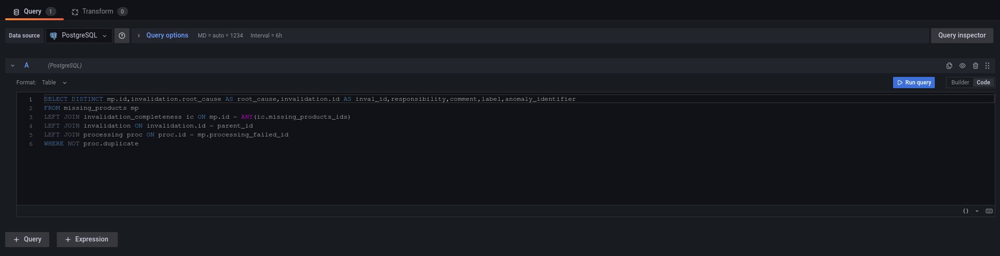

# Description

This plugin is a panel used to manage invalidations associated to missing products.

It display a table with selectable rows and action buttons above the table:

- `create` an invalidation associated to the missing product. This action is
   available when all selected missing product are not linked to an existing
   invalidation. It opens a drawer with a form to fill to create the
   invalidation.

- `edit` the invalidation associated to the selected missing product. This action is
   available when only one missing product is selected. It opens a drawer with a form
   to fill to edit the invalidation. If the invalidation is also linked to
   other missing products, it will ask if you want to modify the invalidation and
   thus affect all missing products or create a new invalidation for the selected
   missing product.

- `link` an invalidation to the selected missing products. This action is available
   when all selected missing products are not already linked to an invalidation. It
   opens a drawer with a select button to select an existing invalidation id.
   You can pick a time range to change the select options or directly type an
   id in the select. If the id exists you will be able to save.

- `unlink` the invalidation associated to the selected missing product. This action is
   available when only one missing product linked to an invalidation is
   selected.

- `delete` the invalidation associated to the selected missing products. This action
   is available when all selected missing products are linked to an invalidation (it
   can be different invalidation for each missing product). It will ask confirmation.
   Before actually delete the invalidation from the database, it will unlink
   all missing products linked to the invalidation.

## Datasource and panel creation

- Add a panel
- Choose the `invalidation completeness` in the list of panels
- Select a `PostgreSQL` DataSource
- Choose Table Format and click on the code tab
- Copy your SQL request in the text area and run query

```sql
SELECT DISTINCT mp.id,invalidation.root_cause AS root_cause,invalidation.id AS inval_id,responsibility,comment,label,anomaly_identifier
FROM missing_products mp  
LEFT JOIN invalidation_completeness ic ON mp.id = ANY(ic.missing_products_ids)
LEFT JOIN invalidation ON invalidation.id = parent_id
LEFT JOIN processing proc ON proc.id = mp.processing_failed_id 
WHERE NOT proc.duplicate
```



## Configuration

- If you want to have an automatic refresh of the table, you must be in edit mode of the plugin
- You can configure the list of root cause
You can add a root cause (append Button) or delete a root cause (trash icon button)
Click on validate button to save the new list

------
