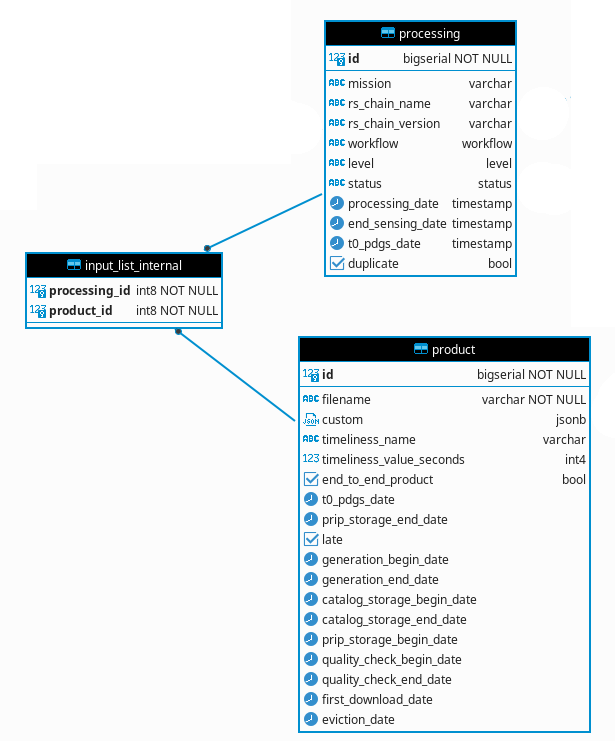

# trace-processor

Ingest in database filtered trace

## trace-filter

### Configuration file

Application in charge of filtering trace is based on one or more rules.
Rules are defined in a YAML configuration file with the following syntax (See [Filter config file](../rs-cores/MONITORING/Executables/additional_resources/ConfigMap-filter.yaml) for a complete example):
```yaml
filters:
  -
    name: filter-1
    rules:
      log.trace.task.event: begin
      log.trace.output: toto
  -
    name: filter-2
    rules:
      log.trace.task.event: begin|end
      log.trace.header.type: REPORT
      log.trace.task.output[filename_strings]: .*_DSIB\.xml
```

The configuration file depict a list of filter to apply where each contains at least one or more rules to check. If we take the case of the above example we have two filters defined named 'filter-1' and 'filter-2'. The first filter contains to rule to check and the second three.

Filter are grouped under 'filters' property name which is mandatory and start with a dash followed by filter definition. A filter is defined by a name and a 'rules' section.

Rules section can be composed of one or more rule. Each rule is a key/value association:
- Keys are 'path' of trace structure where each level is separated by a dot. For example 'log.trace.header.type' key path is associated to 'type' key of the 'header' section of 'trace' structure (for a complete definition of a trace structure, see 'RS Trace format ICD)' .
- Values can be of three type:
  - fixed characters (i.e. compression-L0)
  - regular expression (i.e. compression-.*)
  - multiple value (i.e. compression-.*|generation) separated by a '|' character

Note that all key rules (trace path) are prefixed by 'log.'. This is due to how trace are received by the application. All trace are encapsulated in a 'log' structure.

Some keys defined in 'RS Trace format' ICD does not define the structure that belongs to. The structure is adjustable depending on the application that will produce the trace (Sentinel 1, 2, 3 processor, chunk/dsib ingestion, aux data ingestion, ...)
In such structure, the way to reach a key is to use bracket '[]' instead of a dot '.':
- log.trace.task.output[filename_strings]
- log.trace.task.missing_output[product_metadata_custom_object]

To define regular expression please refer to [Java regex](https://docs.oracle.com/en/java/javase/17/docs/api/java.base/java/util/regex/Pattern.html). For special characters as of '.', '*' and so on you have to escape them with '\\' characters. For example to escape dot and use it as simple character use the following syntax: '\.'. List of special characters is the following:
- \
- .
- ?
- \*
- \+
- ^
- $
- [
- ]
- (
- )
- {
- }
- !
- :

### Input

Application expect to receive trace in string format and encapsulated in a log structure.

### Behavior

The behavior of the filter is to take in the order each filter definition and find if one filter can be associated to the trace. A filter is associated to the trace if all rules can be validated. A rule is valid if the key path exists in the trace structure and if the value correspond to the one available in the trace (if the value defined by the path is null it's considered that the rule does not match). 
Once a filter match the trace the others are not checked. If no filter can be associated, the trace is 'sent to the trash'.


Trace filter is also able to detect file changes and to reload configuration. Changes are applied on start of trace check and not during a trace check. File changes is checked every minute. A log is displayed on the console when configuration file is reloaded (Configuration file '<file-path>' loaded)


Before filters are applied to a trace, the application will first check that the trace is valid. A trace is valid if :
- all required field are set
- format for date field correspond to the one defined
- format for uid field correspond to the one defined
- field limited in size does not exceed the quota.

### Output

When a filter match to a trace, the application send message with trace formatted as an object and the name of the filter applied. If no filter match the trace, nothing is sent. 

### Execution

To start the application please define the following property 'filter.path'. It indicates where configuration file is located. If property is not set or path wrong, the application won't start.

Path must be defined with the following prefix 'file:' (for example 'file:/config/filter.yaml')

Also define property 'spring.kafka.bootstrap-servers' to indicate kafka URL server 

#### Troubleshooting

If the application don't start/run properly you can set property 'logging.level.eu.csgroup.coprs' to 'DEBUG' or 'TRACE' to have details on application execution.
If the issue is due to a dependency you can set property 'logging.level' to 'DEBUG' value to have dependency log.

## trace-ingestor

The trace ingestor application is intended to 'map' a trace into one or more entity (table record) and storing them into a database. Below diagram describe available entities for mapping:


### Configuration file

Application in charge of trace ingestion is based on one or more ingestion strategy. 
Ingestion strategy are defined in a YAML configuration file with the following syntax (See [Filter config file](../rs-cores/MONITORING/Executables/additional_resources/ConfigMap-ingestor.yaml) for a complete example):
```yaml
ingestions:
  -
    name: ingestion-1
    mappings:
      - from: log.trace.task.input[filename_string]
        match: ^GS2B.+(?=.zip)|GS2B.+$
        convert: "%1$s"
        to: dsib.filename
      - from: log.trace.header.mission
        to: dsib.mission
  -
    name: ingestion-2
    mappings:
      - from: log.trace.task.input[filename_string]
        to: chunk.filename
      - from: log.trace.header.mission
        to: chunk.mission
```

'ingestion' section is mandatory and group all ingestion configuration. An ingestion configuration is defined by:
- **name**: a name that must match one of defined in the filter configuration file  (cf. [Trace filter configuration](#trace-filter)).
- **mappings**: a list of rule to map a trace field to an entity field.
- **alias**: a list of alias that is intended to limit relation of an entity with the others.

#### Mappings

A mapping can be configured with the following properties:

| Name                  | Mandatory | Description                                                                                                                                                                                                                                    | Value                                          |
|-----------------------|:---------:|------------------------------------------------------------------------------------------------------------------------------------------------------------------------------------------------------------------------------------------------|------------------------------------------------|
| from                  |     x     | Path in trace structure (See 'RS Trace form' ICD)                                                                                                                                                                                              | a path                                         |
| remove_entity_if_null |           | Do not store entity if value in the trace is null (discard entity creation)                                                                                                                                                                    | true or false (by default false)               |
| match                 |           | Define a regular expression that value must match (See [Java regex](https://docs.oracle.com/en/java/javase/17/docs/api/java.base/java/util/regex/Pattern.html)). If value is not an array and not match to expression, discard entity creation | a regular expression (by default no value set) |
| convert               |           | Define a format based on capturing group of the regular expression (See [Java formatting](https://docs.oracle.com/en/java/javase/17/docs/api/java.base/java/util/Formatter.html))                                                              | a format expression (by default no value set)  |
| to                    |     x     | Path in entity structure                                                                                                                                                                                                                       | a path                                         |


1. [x] **Single entity use case**

Defining multiple mapping rule for an entity (for example processing) will lead to the creation of only one entity.

Config:
```yaml
ingestions:
  -
    name: processing
    mappings:
      - from: log.trace.task.status
        to: processing.status
      - from: log.trace.header.mission
        to: processing.mission
      - from: log.trace.header.level
        to: processing.level
      - from: log.trace.header.workflow
        to: processing.workflow
```

Result:

| id  | mission | rs_chain_name | rs_chain_version | workflow | level | status | processing_date | end_sensing_date | t0_pdgs_date | duplicate |
|-----|---------|---------------|------------------|----------|-------|--------|-----------------|------------------|--------------|-----------|
| 13  | S2      |               |                  | NOMINAL  | INFO  |        |                 |                  |              | false     |


1. [x] **Multi entity use case**

It's possible to mix mapping for different entity:
```yaml
ingestions:
  -
    name: chunk and aux_data
    mappings:
      - from: log.trace.task.input[filename_strings]
        match: DCS_.+?\.raw$
        to: chunk.filename
      - from: log.trace.header.mission
        to: chunk.mission
      - from: log.trace.task.input[filename_strings]
        match: ^([0-9A-Za-z][0-9A-Za-z])([0-9A-Za-z_])(_(OPER|TEST))?_(AMH_ERRMAT|AMV_ERRMAT|AM__ERRMAT|AUX_CAL|AUX_ICE|AUX_INS|AUX_ITC|AUX_OBMEMC|AUX_PP1|AUX_PP2|AUX_POEORB|AUX_PREORB|AUX_RESORB|AUX_SCF|AUX_SCS|AUX_TEC|AUX_TRO|AUX_WAV|AUX_WND|MPL_ORBPRE|MPL_ORBRES|MPL_ORBSCT|MSK_EW_SLC|MSK__LAND_|MSK_OCEAN_|MSK_OVRPAS)_\w{1,}\.(XML|EOF|SAFE)(/.*)?|(S2)(A|B|_)_(OPER|TEST)_((AUX|GIP)_[0-9A-Z_]{7})(.*)|([a-zA-Z0-9][a-zA-Z0-9])(\w{1})_((OL|SL|SR|DO|MW|GN|SY|TM|AX)_(0|1|2|_)_\w{4}AX)_(\d{8}T\d{6})_(\d{8}T\d{6})_(\d{8}T\d{6})_(_{17})_(\w{3})_(\w{8})\.(SEN3)\/?(.+)?$
        to: aux_data.filename
      - from: log.trace.header.mission
        to: aux_data.mission
```

1. [x] **Array use case**

In some circumstances if the value extracted in the trace according to 'from' properties is an array and type of field defined in entity by 'to' properties is not an array, this will lead to the creation of an entity for each value in the array.

Config:
```yaml
ingestions:
  -
    name: chunk
    mappings:
      - from: log.trace.task.input[filename_strings]
        match: DCS_.+?\.raw$
        to: chunk.filename
      - from: log.trace.header.mission
        to: chunk.mission
```

Result:

| id | filename                                           | mission | pickup_point_seen_date | pickup_point_available_date | ingestion_date | catalog_storage_date | custom |
|----|----------------------------------------------------|---------|------------------------|-----------------------------|----------------|----------------------|--------|
| 14 | DCS_05_S2B_20210927072424023813_ch2_DSDB_00002.raw | S2      |                        |                             |                |                      |        |
| 16 | DCS_05_S2B_20210927072424023813_ch1_DSDB_00001.raw | S2      |                        |                             |                |                      |        |
| 18 | DCS_05_S2B_20210927072424023813_ch2_DSDB_00001.raw | S2      |                        |                             |                |                      |        |
| 19 | DCS_05_S2B_20210927072424023813_ch2_DSDB_00003.raw | S2      |                        |                             |                |                      |        |
| 20 | DCS_05_S2B_20210927072424023813_ch1_DSDB_00002.raw | S2      |                        |                             |                |                      |        |
| 21 | DCS_05_S2B_20210927072424023813_ch1_DSDB_00003.raw | S2      |                        |                             |                |                      |        |

1. [x] **Array use case and filtering**

Defining a 'match' and optionally 'convert' properties on a 'from' properties which describe an array value will filter them and create only an entity for those matching the regular expression.

Config;
```yaml
ingestions:
  -
    name: product
    mappings:
      - from: log.trace.task.input[filename_strings]
        match: ^GS2B.+(?=.zip)|GS2B.+$
        convert: "%1$s"
        to: product.filename
```

Array value:
- DCS_05_S2B_20210927072424023813_ch1_DSDB_00001.raw
- DCS_05_S2B_20210927072424023813_ch1_DSDB_00002.raw
- DCS_05_S2B_20210927072424023813_ch1_DSDB_00003.raw
- DCS_05_S2B_20210927072424023813_ch2_DSDB_00001.raw
- DCS_05_S2B_20210927072424023813_ch2_DSDB_00002.raw
- DCS_05_S2B_20210927072424023813_ch2_DSDB_00003.raw
- S1A_OPER_AMH_ERRMAT_W.XML
- S2A_OPER_AUX_TEST_TE
- S3A_OL_0_TESTAX_12345678T123456_12345678T123456_12345678T123456___________________123_12345678.SEN3
- GS2B_20170322T000000_013601_N02.05
- GS2B_20170322T000000_013601_N02.06.zip

Result:

| id  | filename                            | custom | timeliness_name | timeliness_value_seconds | end_to_end_product | duplicate | t0_pdgs_date | prip_storage_date | late  |
|-----|-------------------------------------|--------|-----------------|--------------------------|--------------------|-----------|--------------|-------------------|-------|
| 7   | GS2B_20170322T000000_013601_N02.05  |        |                 |                          | false              | false     |              |                   | false |
| 8   | GS2B_20170322T000000_013601_N02.06  |        |                 |                          | false              | false     |              |                   | false |

1. [x] **Null value**

In some circumstances, value extracted on a trace can be null or not but we don't want to create entity with such null value. To avoid entity creation with null value for specific field you can use the 'remove_entity_if_null' property. Below configuration give an example of such case:
```yaml
ingestions:
  -
    name: missing_output
    mappings:
      - from: log.trace.task.missing_output[product_metadata_custom_object]
        remove_entity_if_null: true
        to: missing_products.product_metadata_custom
      - from: log.trace.task.missing_output[end_to_end_product_boolean]
        to: missing_products.end_to_end_product
      - from: log.trace.task.missing_output[estimated_count_integer]
        to: missing_products.estimated_count
```

#### Alias

'product' table store informations of product that are used as output and/or input of a process. To define in which case a product is used in a processing two additional table exists:
- 'input_list_internal' which is used to store product used as input of a process
- 'output_list' which is used to store product used as output of a process

In configuration file, the way to indicate that a product entity must be used to reference 'input_list_internal' entity or output_list is to use an alias. Below configuration give an example of how to configure such case:
```yaml
ingestions:
  -
    name: input and output product
    mappings:
      - from: log.trace.task.output[filename_strings]
        match: ^.+(?=.zip)|.+$
        convert: "%1$s"
        to: output_product.filename
      - from: log.trace.task.input[filename_strings]
        match: ^GS2B.+(?=.zip)|GS2B.+$
        convert: "%1$s"
        to: input_product.filename
    alias:
      input_product:
        entity: product
        restrict: input_list_internal
      output_product:
        entity: product
        restrict: output_list
  ```

The alias allow to name an entity differently and so add further behavior such as restricting relation with other entity (use of 'restrict' properties). In the above example, all entity that will be created with the 'input_product' alias will be used to create entity for 'input_list_internal' table. In the other side all entity that will be created with the 'output_product' alias will be used to create entity for 'output_list' table.

### Input

The application expect to receive trace formatted as an object and the name of filter that was applied (needed to retrieve ingestion config to apply).

### Behavior

When the application receive a filtered trace it chose which ingestion configuration to apply by retrieving the name of the filter that was applied.

1. [x] **Entity related to configured one**

Depending on which entity is mapped, the application check the entity that are in relation with the first ones. If all entities are available to create the related entity the last one will be created during the process.
For example if we have below configuration:
```yaml
ingestions:
  -
    name: processing and input product
    mappings:
      - from: log.trace.task.input[filename_strings]
        match: ^GS2B.+(?=.zip)|GS2B.+$
        convert: "%1$s"
        to: input_product.filename
      - from: log.trace.task.status
        to: processing.status
      - from: log.trace.header.mission
        to: processing.mission
      - from: log.trace.header.level
        to: processing.level
      - from: log.trace.header.workflow
        to: processing.workflow
    alias:
      output_product:
        entity: product
        restrict: input_list_internal
```

By configuring mapping for processing and output product entities, the application will also create entities for input_list_internal tables:


At the other side if only mapping for processing or input product is configured, entities for input_list_internal table won't be created.

1. [x] **Child entities**

In the same way, application is also able to detect relation with child and parent table (subclass in Java world). So by configuring mapping for chunk and processing entities:
```yaml
ingestions:
  -
    name: processing and chunk
    mappings:
      - from: log.trace.task.input[filename_strings]
        match: DCS_.+?\.raw$
        to: chunk.filename
      - from: log.trace.header.mission
        to: chunk.mission
      - from: log.trace.task.status
        to: processing.status
      - from: log.trace.header.mission
        to: processing.mission
      - from: log.trace.header.level
        to: processing.level
      - from: log.trace.header.workflow
        to: processing.workflow
```
The application will also create entities for input_list_external tables because 'chunk' table is a child of 'external_input' table:


'external_input' table is the only one that is subclassed in Java world so chunk, dsib and aux_data are the only one that share behavior described above.

1. [x] **Entity creation with another one**

The last given example is a bit more complex than it seems. In fact, when configuring mapping for chunk entities, mapping for dsib entities is automatically added. The reason why this is done it's because such behavior is added programmatically. We know that chunk and dsib share the same root file name so it's easy to create dsib entity by using chunk entities.

**Be careful by letting application creating dsib entities with chunk entities this won't create input_list_external entities for dsib relation. If you wan't to create input_list_external relation for dsib entities, you have to explicitly configure mapping for dsib entities.**

1. [x] **Entity update**

The application is able to update existing entity by checking in database if there is an already one that exists and replacing field which is a simple value (such as timestamp, varchar, bool, ...) but also to update field which is a complex value (such as jsonb).

For complex value, it's nothing more than a map where you can put new key/value pair or replace value for an existing key. If you have configured a mapping to modify the root directly it will replace it and not attempt a merge.

**Note that if a key already exists and value is an array, application will systematically add new value into the existing array (whatever the new value is but do not add duplicate value).**


Nevertheless application is not able to remove value for a field that is already filled.

1. [x] **Entity search**

To find for an existing entity in database, application base its search on field that are marked as _unique_. Entity with unique field are the following:
- external_input.filename (applicable for chunk, dsib and aux_data)
- product.filename

### Execution

To start the application please define the following property 'ingestion.path'. It indicates where configuration file is located. If property is not set or path wrong, the application won't start.

Path must be defined with the following prefix 'file:' (for example `file:/config/ingestion.yaml`)

You also have to define properties related to database access:
- spring.datasource.username
- spring.datasource.password
- spring.datasource.url

spring datasource url must be of the form `jdbc:postgresql://<ip>:<port>/<database name>`

Also define property 'spring.kafka.bootstrap-servers' to indicate kafka URL server 