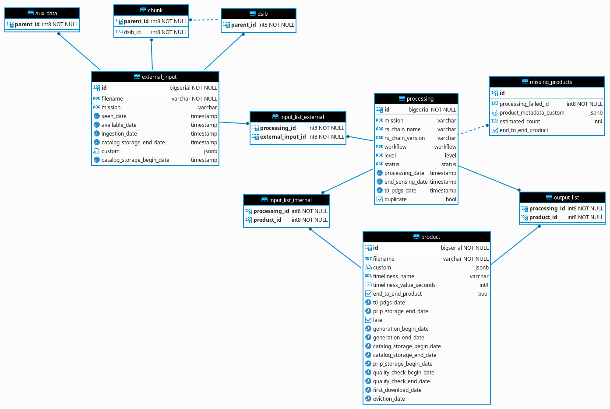
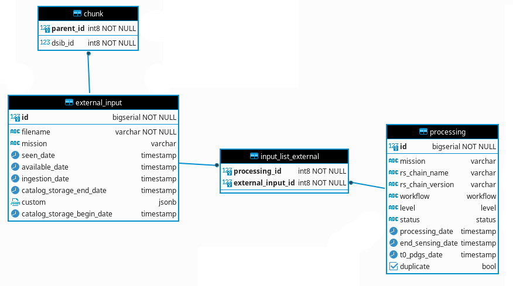

# trace-processor

The trace processor ingests filtered traces in a database.

<!-- TOC -->
* [Trace processor](#trace-processor)
  * [Trace filter](#trace-filter)
    * [Configuration file](#configuration-file)
    * [Input](#input)
    * [Behavior](#behavior)
    * [Output](#output)
    * [Execution](#execution)
    * [Troubleshooting](#troubleshooting)
  * [Trace ingestor](#trace-ingestor)
    * [Configuration file](#configuration-file-1)
      * [Mapping](#mappings)
      * [Alias](#alias)
    * [Input](input-1)
    * [Behavior](#behavior-1)
    * [Execution](#execution-1)
<!-- TOC -->

## trace-filter

### Configuration file

The application in charge of filtering traces is based on one or more rules.
Rules are defined in a YAML configuration file with the following syntax (See [Filter config file](../rs-cores/MONITORING/Executables/additional_resources/ConfigMap-filter.yaml) for a complete example):
```yaml
filters:
  -
    name: filter-1
    rules:
      log.trace.task.event: begin
      log.trace.output: toto
  -
    name: filter-2
    rules:
      log.trace.task.event: begin|end
      log.trace.header.type: REPORT
      log.trace.task.output[filename_strings]: .*_DSIB\.xml
```

The configuration file depicts a list of filters to apply where each contains at least one or more rules to check. If we take the case of the above example we have two filters defined named 'filter-1' and 'filter-2'. The first filter contains two rules to check and the second three.

Filters are grouped under the 'filters' property name which is mandatory and starts with a dash followed by the filters definition. A filter is defined by a name and a 'rules' section.

Rules section can be composed of one or more rules. Each rule is a key/value association:
- Keys are 'path' of trace structure where each level is separated by a dot. For example 'log.trace.header.type' key path is associated to 'type' key of the 'header' section of 'trace' structure (for a complete definition of a trace structure, see 'RS Trace format ICD)' .
- Values can be of three type:
  - fixed characters (i.e. compression-L0)
  - regular expression (i.e. compression-.*)
  - multiple value (i.e. compression-.*|generation) separated by a '|' character

Note that all key rules (trace path) are prefixed by 'log.'. This is due to how traces are received by the application. All traces are encapsulated in a 'log' structure.

Some keys defined in the 'RS Trace format' ICD do not define the structure they belong to. The structure is adjustable depending on the application that will produce the trace (Sentinel 1, 2, 3 processor, chunk/dsib ingestion, aux data ingestion, ...)
In such structure, the way to reach a key is to use bracket '[]' instead of a dot '.':
- log.trace.task.output[filename_strings]
- log.trace.task.missing_output[product_metadata_custom_object]

To define regular expressions please refer to [Java regex](https://docs.oracle.com/en/java/javase/17/docs/api/java.base/java/util/regex/Pattern.html). For special characters such as '.', '*' and so on you have to escape them with '\\' characters. For example to escape dot and use it as simple character use the following syntax: '\.'. The list of special characters is the following:
- \
- .
- ?
- \*
- \+
- ^
- $
- [
- ]
- (
- )
- {
- }
- !
- :

### Input

The application expects to receive traces in string format and encapsulated in a log structure.

### Behavior

The behavior of the filter is to take in the order each filter definition and find if one filter can be associated to the trace. A filter is associated to the trace if all rules can be validated. A rule is valid if the key path exists in the trace structure and if the value correspond to the one available in the trace (if the value defined by the path is null it is considered that the rule does not match). 
Once a filter matches the trace the others are not checked. If no filter can be associated, the trace is 'sent to the trash'.


Trace filter is also able to detect file changes and reload configuration. Changes are applied on start of a trace check and not during a trace check. File changes are checked every minute. A log is displayed on the console when configuration file is reloaded (Configuration file '<file-path>' loaded)


Before filters are applied to a trace, the application will first check that the trace is valid. A trace is valid if :
- all required field are set
- the format for date field corresponds to the one defined
- the format for uid field corresponds to the one defined
- fields limited in size do not exceed the quotas.

### Output

When a filter matches to a trace, the application sends a message with the trace formatted as an object and the name of the filter applied. If no filter matches the trace, nothing is sent. 

### Execution

To start the application please define the following property 'filter.path'. It indicates where the configuration file is located. If this property is not set or the path is wrong, the application will not start.

Paths must be defined with the following prefix 'file:' (for example 'file:/config/filter.yaml')

Please also define property 'spring.kafka.bootstrap-servers' to indicate the kafka URL server. 

#### Troubleshooting

If the application does not start/run properly you can set the property 'logging.level.eu.csgroup.coprs' to 'DEBUG' or 'TRACE' to have details on application execution.
If the issue is due to a dependency you can set the property 'logging.level' to 'DEBUG' value to have a dependency log.

## trace-ingestor

The trace ingestor application is intended to 'map' a trace into one or more entites (table record) and storing them into a database. The diagram below describes available entities for mapping:


### Configuration file

The application in charge of trace ingestion is based on one or more ingestion strategies. 
Ingestion strategies are defined in a YAML configuration file with the following syntax (See [Filter config file](../rs-cores/MONITORING/Executables/additional_resources/ConfigMap-ingestor.yaml) for a complete example):
```yaml
ingestions:
  -
    name: ingestion-1
    mappings:
      - from: log.trace.task.input[filename_string]
        action: FORMAT ^GS2B.+(?=.zip)|GS2B.+$ %1$s
        to: dsib.filename
      - from: log.trace.header.mission
        to: dsib.mission
  -
    name: ingestion-2
    mappings:
      - from: log.trace.task.input[filename_string]
        to: chunk.filename
      - from: log.trace.header.mission
        to: chunk.mission
```

The 'ingestion' section is mandatory and groups all ingestion configurations. An ingestion configuration is defined by:
- **name**: a name that must match one defined in the filter configuration file  (cf. [Trace filter configuration](#trace-filter)).
- **mappings**: a list of rules to map a trace field to an entity field.
- **alias**: a list of aliases that is intended to limit relations of an entity with the others.

#### Mappings

A mapping can be configured with the following properties:

| Name                   | Mandatory | Description                                                                                                                                                                                                                                                                                                                                                                                                                                                                                     | Value                                                        |
|------------------------|:---------:|-------------------------------------------------------------------------------------------------------------------------------------------------------------------------------------------------------------------------------------------------------------------------------------------------------------------------------------------------------------------------------------------------------------------------------------------------------------------------------------------------|--------------------------------------------------------------|
| from                   |     x     | Path of the value to reach in trace structure (See 'RS Trace form' ICD):<br/>-from: log.trace.header.timestamp<br><br> You can associate path to an alias for later and easy reuse in action property:<br/>- from: al1 -> log.trace.header.timestamp<br><br>It's also possible to define a list of path to use in action property:<br>- from:<br>&nbsp;&nbsp;&nbsp;&nbsp;- al1 -> log.trace.header.timestamp<br>&nbsp;&nbsp;&nbsp;&nbsp;- al2 -> log.trace.task.duration_in_seconds | a path                                                       |
| remove_entity_if_null  |           | Do not store entity if value in the trace is null (discard entity creation)                                                                                                                                                                                                                                                                                                                                                                                                                     | true or false (by default false)                             |
| action                 |           | Indicate an action to execute on retrieved value before setting them in entity                                                                                                                                                                                                                                                                                                                                                                                                                  | (See below table for the syntax to use and available action) | 
| set_value_only_if_null |           | Set value in entity field symbolized by 'to' property is not already set                                                                                                                                                                                                                                                                                                                                                                                                                        | true or false (by default false)                             |
| to                     |     x     | Path where to put value in entity structure                                                                                                                                                                                                                                                                                                                                                                                                                                                     | a path                                                       |

Available actions:

| Name     | Syntax                              | Description                                                                                                                                                                                                                                                                                                                                                                                                                                                                                                                                                                                                                                                                                                                                                                                                                                                                             | Example                                                                                                                                                                                |
|----------|-------------------------------------|-----------------------------------------------------------------------------------------------------------------------------------------------------------------------------------------------------------------------------------------------------------------------------------------------------------------------------------------------------------------------------------------------------------------------------------------------------------------------------------------------------------------------------------------------------------------------------------------------------------------------------------------------------------------------------------------------------------------------------------------------------------------------------------------------------------------------------------------------------------------------------------------|----------------------------------------------------------------------------------------------------------------------------------------------------------------------------------------|
| MATCH    | MATCH \<pattern> \<from>            | Check value before setting it in entity field. If value does not match the pattern entity is not created. In case of value is an array, keep only those matching the pattern. If target type of the field in entity is an array set matching result as is (even if  array is empty). In the other case, create an entity for each value in the array (if array is empty do not create any entity).<br><br>Available arguments are:    <br>   - \<pattern>: Define a regular expression that the value must match (See [Java regex](https://docs.oracle.com/en/java/javase/17/docs/api/java.base/java/util/regex/Pattern.html)). If value is not an array and does not match to expression, discard entity creation <br/> - \<from>: Path of the value in trace structure to use in action or the alias associated to.                                                                   | MATCH DCS_.+?\.raw$  <br/><br>If you retrieve one from value you are not forced to set 'from' value to use. It will automatically retrieve the last value available                    |
| FORMAT   | FORMAT \<pattern> \<format> \<from> | Format a value matching to the pattern (must contains capturing group). The FORMAT action has the same behavior than the MATCH action. <br><br>Available arguments are:<br>- \<pattern>: Define a regular expression that the value must match (See [Java regex](https://docs.oracle.com/en/java/javase/17/docs/api/java.base/java/util/regex/Pattern.html)). If value is not an array and does not match to expression, discard entity creation.<br>- \<format>: Define a format based on capturing group of the regular expression (See [Java formatting](https://docs.oracle.com/en/java/javase/17/docs/api/java.base/java/util/Formatter.html))                                                                                                                                                                                                                                     | FORMAT ^.+(?=.zip)&#124;.+$ %1$s" <br><br> If you retrieve one from value you are not forced to set 'from' value to use. It will automatically retrieve the last value available       |
| SUBTRACT | SUBTRACT <from-1> <from-2>...       | Subtract 'from-2' value to 'from-1' value. You can set as many value as you want for 'from-2' argument.<br><br> Available arguments are:<br>- \<from-1>: Reference value to which to subtract (can be a date, double, long or integer type).<br>- \<from-2>: value to subtract to 'from-1' value. You can set as many value as you want.<br><br>this action is able to handle date, double, long and integer type. In case of 'from-1' value is a date:<br>- double is considered as a value in second and can handle precision to nanosecond,<br> - integer is considered as a value in second,<br> - long is considered as a value in second,<br> - date is considered as a value in millisecond<br><br>If 'from-1' value is other than date type, and 'from-2' value is a date, retrieve value in millisecond. <br><br> Type of 'from-1' value is conserved and is the one returned. | - from:<br>&nbsp;&nbsp;&nbsp;&nbsp;- al1 -> log.trace.header.timestamp<br>&nbsp;&nbsp;&nbsp;&nbsp;- al2 -> log.trace.task.duration_in_seconds<br>&nbsp;&nbsp;action: SUBSTRACT al1 al2 |

1. [x] **Single entity use case**

Defining multiple mapping rules for an entity (for example processing) will lead to the creation of only one entity.

Config:
```yaml
ingestions:
  -
    name: processing
    mappings:
      - from: log.trace.task.status
        to: processing.status
      - from: log.trace.header.mission
        to: processing.mission
      - from: log.trace.header.level
        to: processing.level
      - from: log.trace.header.workflow
        to: processing.workflow
```

Result:

| id  | mission | rs_chain_name | rs_chain_version | workflow | level | status | processing_date | end_sensing_date | t0_pdgs_date | duplicate |
|-----|---------|---------------|------------------|----------|-------|--------|-----------------|------------------|--------------|-----------|
| 13  | S2      |               |                  | NOMINAL  | INFO  |        |                 |                  |              | false     |


1. [x] **Multi entity use case**

It is possible to mix mappings for different entity:
```yaml
ingestions:
  -
    name: chunk and aux_data
    mappings:
      - from: log.trace.task.input[filename_strings]
        action: MATCH DCS_.+?\.raw$
        to: chunk.filename
      - from: log.trace.header.mission
        to: chunk.mission
      - from: log.trace.task.input[filename_strings]
        action: MATCH ^([0-9A-Za-z][0-9A-Za-z])([0-9A-Za-z_])(_(OPER|TEST))?_(AMH_ERRMAT|AMV_ERRMAT|AM__ERRMAT|AUX_CAL|AUX_ICE|AUX_INS|AUX_ITC|AUX_OBMEMC|AUX_PP1|AUX_PP2|AUX_POEORB|AUX_PREORB|AUX_RESORB|AUX_SCF|AUX_SCS|AUX_TEC|AUX_TRO|AUX_WAV|AUX_WND|MPL_ORBPRE|MPL_ORBRES|MPL_ORBSCT|MSK_EW_SLC|MSK__LAND_|MSK_OCEAN_|MSK_OVRPAS)_\w{1,}\.(XML|EOF|SAFE)(/.*)?|(S2)(A|B|_)_(OPER|TEST)_((AUX|GIP)_[0-9A-Z_]{7})(.*)|([a-zA-Z0-9][a-zA-Z0-9])(\w{1})_((OL|SL|SR|DO|MW|GN|SY|TM|AX)_(0|1|2|_)_\w{4}AX)_(\d{8}T\d{6})_(\d{8}T\d{6})_(\d{8}T\d{6})_(_{17})_(\w{3})_(\w{8})\.(SEN3)\/?(.+)?$
        to: aux_data.filename
      - from: log.trace.header.mission
        to: aux_data.mission
```

1. [x] **Array use case**

In some circumstances if the value extracted in the trace according to 'from' properties is an array and the type of field defined in entity by 'to' properties is not an array, this will lead to the creation of an entity for each value in the array.

Config:
```yaml
ingestions:
  -
    name: chunk
    mappings:
      - from: log.trace.task.input[filename_strings]
        action: MATCH DCS_.+?\.raw$
        to: chunk.filename
      - from: log.trace.header.mission
        to: chunk.mission
```
In the following example we also filter array to keep only chunk

Result:

| id | filename                                           | mission | pickup_point_seen_date | pickup_point_available_date | ingestion_date | catalog_storage_date | custom |
|----|----------------------------------------------------|---------|------------------------|-----------------------------|----------------|----------------------|--------|
| 14 | DCS_05_S2B_20210927072424023813_ch2_DSDB_00002.raw | S2      |                        |                             |                |                      |        |
| 16 | DCS_05_S2B_20210927072424023813_ch1_DSDB_00001.raw | S2      |                        |                             |                |                      |        |
| 18 | DCS_05_S2B_20210927072424023813_ch2_DSDB_00001.raw | S2      |                        |                             |                |                      |        |
| 19 | DCS_05_S2B_20210927072424023813_ch2_DSDB_00003.raw | S2      |                        |                             |                |                      |        |
| 20 | DCS_05_S2B_20210927072424023813_ch1_DSDB_00002.raw | S2      |                        |                             |                |                      |        |
| 21 | DCS_05_S2B_20210927072424023813_ch1_DSDB_00003.raw | S2      |                        |                             |                |                      |        |

1. [x] **Array use case and filtering**

Defining a 'match' and optionally 'convert' properties on a 'from' properties which describes an array value will filter them and create only an entity for those matching the regular expression.

Config;
```yaml
ingestions:
  -
    name: product
    mappings:
      - from: log.trace.task.input[filename_strings]
        action: FORMAT ^GS2B.+(?=.zip)|GS2B.+$ %1$s
        to: product.filename
```

Array value:
- DCS_05_S2B_20210927072424023813_ch1_DSDB_00001.raw
- DCS_05_S2B_20210927072424023813_ch1_DSDB_00002.raw
- DCS_05_S2B_20210927072424023813_ch1_DSDB_00003.raw
- DCS_05_S2B_20210927072424023813_ch2_DSDB_00001.raw
- DCS_05_S2B_20210927072424023813_ch2_DSDB_00002.raw
- DCS_05_S2B_20210927072424023813_ch2_DSDB_00003.raw
- S1A_OPER_AMH_ERRMAT_W.XML
- S2A_OPER_AUX_TEST_TE
- S3A_OL_0_TESTAX_12345678T123456_12345678T123456_12345678T123456___________________123_12345678.SEN3
- GS2B_20170322T000000_013601_N02.05
- GS2B_20170322T000000_013601_N02.06.zip

Result:

| id  | filename                            | custom | timeliness_name | timeliness_value_seconds | end_to_end_product | duplicate | t0_pdgs_date | prip_storage_date | late  |
|-----|-------------------------------------|--------|-----------------|--------------------------|--------------------|-----------|--------------|-------------------|-------|
| 7   | GS2B_20170322T000000_013601_N02.05  |        |                 |                          | false              | false     |              |                   | false |
| 8   | GS2B_20170322T000000_013601_N02.06  |        |                 |                          | false              | false     |              |                   | false |

1. [x] **Null value**

In some circumstances, the value extracted on a trace can be null but we don't want to create an entity with such null value. To avoid entity creation with null value for specific field you can use the 'remove_entity_if_null' property. Below configuration give an example of such case:
```yaml
ingestions:
  -
    name: missing_output
    mappings:
      - from: log.trace.task.missing_output[product_metadata_custom_object]
        remove_entity_if_null: true
        to: missing_products.product_metadata_custom
      - from: log.trace.task.missing_output[end_to_end_product_boolean]
        to: missing_products.end_to_end_product
      - from: log.trace.task.missing_output[estimated_count_integer]
        to: missing_products.estimated_count
```

1. [x] **Overwrite value**

By default, if an update is done on an existing entity (already stored in database) applying mapping rule will overwrite existing value in entity. If this behavior is unwanted, you can set 'set_value_only_if_null' property to true to avoid value overwritting in entity:
```yaml
ingestions:
  -
    name: product
    mappings:
      - from: log.trace.task.input[filename_strings]
        action: FORMAT ^GS2B.+(?=.zip)|GS2B.+$ %1$s
        to: product.filename
      - from: log.trace.header.timestamp
        set_value_only_if_null: true
        to: product.first_download_date
```

#### Alias

The 'product' table stores informations of product that are used as output and/or input of a process. To define in which case a product is used in a processing two additional table exists:
- 'input_list_internal' which is used to store product used as input of a process
- 'output_list' which is used to store product used as output of a process

In the configuration file, the way to indicate that a product entity must be used to reference 'input_list_internal' entity or output_list is to use an alias. The configuration file below gives an example of how to configure such a case:
```yaml
ingestions:
  -
    name: input and output product
    mappings:
      - from: log.trace.task.output[filename_strings]
        action: MATCH ^.+(?=.zip)|.+$
        convert: "%1$s"
        to: output_product.filename
      - from: log.trace.task.input[filename_strings]
        action: FORMAT ^GS2B.+(?=.zip)|GS2B.+$ %1$s
        to: input_product.filename
    alias:
      input_product:
        entity: product
        restrict: input_list_internal
      output_product:
        entity: product
        restrict: output_list
  ```

The alias allows to name an entity differently and so add further behavior such as restricting relations with other entity (use of 'restrict' properties). In the above example, all entities that will be created with the 'input_product' alias will be used to create entities for the 'input_list_internal' table. In the other side all entities that will be created with the 'output_product' alias will be used to create entities for the 'output_list' table.

### Input

The application expects to receive trace formatted as an object and the name of filter that was applied (needed to retrieve ingestion configuration to apply).

### Behavior

When the application receives a filtered trace it chooses which ingestion configuration to apply by retrieving the name of the filter that was applied.

1. [x] **Entity related to configured one**

Depending on which entity is mapped, the application checks the entities that are in relation with the first ones. If all entities are available to create the related entity the last one will be created during the process.
For example if we have the configuration below:
```yaml
ingestions:
  -
    name: processing and input product
    mappings:
      - from: log.trace.task.input[filename_strings]
        action: FORMAT ^GS2B.+(?=.zip)|GS2B.+$ %1$s
        to: input_product.filename
      - from: log.trace.task.status
        to: processing.status
      - from: log.trace.header.mission
        to: processing.mission
      - from: log.trace.header.level
        to: processing.level
      - from: log.trace.header.workflow
        to: processing.workflow
    alias:
      output_product:
        entity: product
        restrict: input_list_internal
```

By configuring mapping for processing and output product entities, the application will also create entities for input_list_internal tables:


At the other side if only mapping for processing or input product is configured, entities for input_list_internal table won't be created.

1. [x] **Child entities**

In the same way, application is also able to detect relations with child and parent tables (subclass in Java world). So by configuring mappings for chunk and processing entities:
```yaml
ingestions:
  -
    name: processing and chunk
    mappings:
      - from: log.trace.task.input[filename_strings]
        action: MATCH DCS_.+?\.raw$
        to: chunk.filename
      - from: log.trace.header.mission
        to: chunk.mission
      - from: log.trace.task.status
        to: processing.status
      - from: log.trace.header.mission
        to: processing.mission
      - from: log.trace.header.level
        to: processing.level
      - from: log.trace.header.workflow
        to: processing.workflow
```
The application will also create entities for 'input_list_external' tables because 'chunk' table is a child of 'external_input' table:


The 'external_input' table is the only one that is subclassed in Java world so chunk, dsib and aux_data are the only ones that share behavior described above.

1. [x] **Entity creation with another one**

The last given example is a bit more complex than it seems. In fact, when configuring mapping for chunk entities, mapping for dsib entities is automatically added. The reason why this is done is because such behavior is added programmatically. We know that chunk and dsib share the same root file name so it's easy to create dsib entities by using chunk entities.

**Be careful that by letting the application creating dsib entities with chunk entities this won't create input_list_external entities for dsib relations. If you wan't to create input_list_external relation for dsib entities, you have to explicitly configure mapping for dsib entities.**

1. [x] **Entity update**

The application is able to update existing entities by checking in database if there is one that exists and replacing fields which are simple values (such as timestamp, varchar, bool, ...) but also to update fields which are complex values (such as jsonb).

For complex values, it's nothing more than a map where you can put new key/value pair or replace a value for an existing key. If you have configured a mapping to modify the root directly it will replace it and not attempt a merge.

**Note that if a key already exists and value is an array, the application will systematically add a new value into the existing array (whatever the new value is but do not add duplicate value).**


Nevertheless the application is not able to remove a value for a field that is already filled.

1. [x] **Entity search**

To find for an existing entity in database, the application bases its search on fields that are marked as _unique_. Entities with unique field are the following:
- external_input.filename (applicable for chunk, dsib and aux_data)
- product.filename

### Execution

To start the application please define the following property 'ingestion.path'. It indicates where configuration file is located. If the property is not set or the path wrong, the application will not start.

Paths must be defined with the following prefix 'file:' (for example `file:/config/ingestion.yaml`)

You also have to define properties related to database access:
- spring.datasource.username
- spring.datasource.password
- spring.datasource.url

spring datasource url must be of the form `jdbc:postgresql://<ip>:<port>/<database name>`

Please also define property 'spring.kafka.bootstrap-servers' to indicate the kafka URL server 
